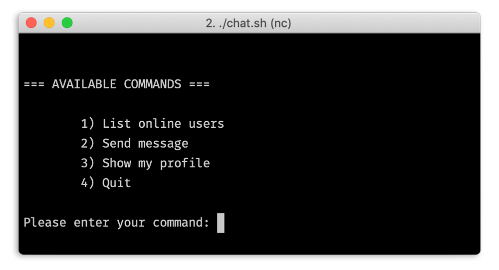

# CmpE 487 Workshop 1
## P2P Bash Chat App
### Requirements
- bash
- netcat
- On the same network with other users

### Usage
```bash
    $ ./chat.sh
```



### License
P2P Bash Chat App is an open-sourced software licensed under the [BSD-2 license](https://opensource.org/licenses/BSD-2-Clause).
