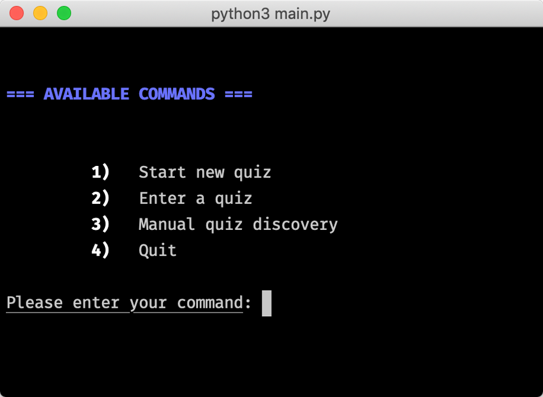
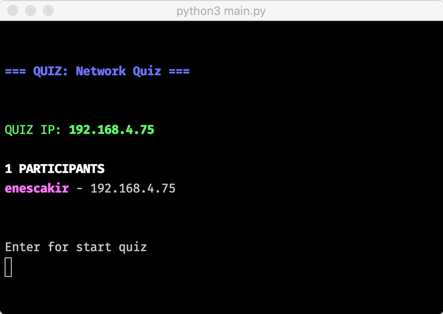

# CmpE 487 Final Project
## Network-Based Realtime Multiple-Choice Quiz Application
<p align="center">
    
</p>

- Moderator creates quizzes manually or imports from prepared text files. 
- Participants connect to the quiz room that is on the server.
- When moderator starts session, participants compete for correct answers. 
- Participants have 10 seconds for each question
#### [Final Presentation PDF](https://github.com/CMPE487/final-project-quizapp/blob/master/Presentation.pdf)

### Usage
Run following command for both Server or Client
```
$ python3 main.py
```


**IMPORTANT NOTE:** Please don't press any key if it's not prompted. Especially when waiting for new questions.
#### Create Quiz
`QuizServer` class handles server operations.
1) Select `Start new quiz`
2) Enter quiz name
3) Select quiz creation method
    - **Import file:** We have samples quizzes. Enter file path. (i.e: `samples/network.txt` `samples/general.txt`)
    - **Manually:** Enter number of the questions in the quiz. Then enter question body and options as prompted.
4) Review questions, enter to continue
5) Wait for participants. Participants can't enter after you sent first question.

6) Send first question, so quiz is started.
7) Wait answers from participants (12 seconds)
8) When you see scores after 12 seconds, you can send simply next question by pressing `Enter`
9) End of the quiz, scores are sent to all participants automatically.

#### Enter a Quiz
`QuizClient` class handles client operations.
1) Select `Enter a quiz`. Discovery sent to network automatically.
    - If you are not in the same subnet with the server, first discover manually with `Manual quiz discovery` option then `Enter a quiz`
2) Select a quiz to enter
3) Enter your username and wait for the first question
4) When question is appeared, enter your answer and press `Enter`.

5) Wait for the next questions and give your answer when it is prompted. 
6) Repeat this process until all questions is done
7) When the all questions are answered, you will see the scoreboard.
8) Highlighted row is your score :)

### Contributors:
- [Mustafa Enes Çakır](https://github.com/EnesCakir)
- [Oğuzhan Yetimoğlu](https://github.com/oguzhanyetimoglu)  

(We did pair programming)

### License
Quiz App is an open-sourced software licensed under the [BSD-2 license](https://opensource.org/licenses/BSD-2-Clause).
