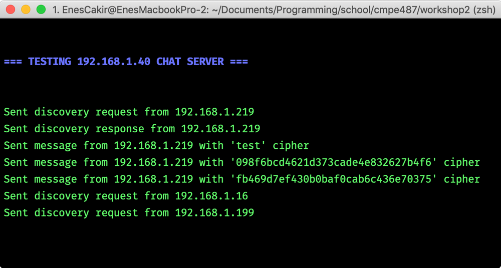

# CmpE 487 Workshop 3
## P2P Zeroconf Chat App

I tested it with Emirhan and Murat
But lots of discovery packeges were not received, discovery is working with ~%20 success

### Requirements
- Python 3
- On the same network with other users

### Usage
```bash
    $ python3 chat.py
```


### Testing
You can create your test scenarios at main function of `test.py`
```bash
    $ python3 test.py ?[TARGET_IP]
```



### License
P2P Python Chat App is an open-sourced software licensed under the [BSD-2 license](https://opensource.org/licenses/BSD-2-Clause).
